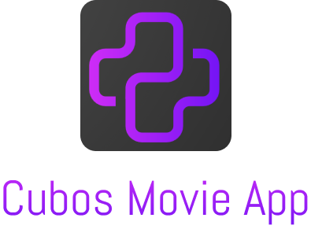

# Cubos Movies App 

  

Cubos Movies App é uma aplicação de pesquisa de filmes construída com React e TypeScript, utilizando a API do TheMovieDB. Este projeto foi desenvolvido como parte de um desafio proposto pela Cubos Tecnologia.

  
  

## Executando o projeto

Para executar o projeto, siga as seguintes instruções:

1. Clone o repositório para o seu ambiente de desenvolvimento.
2. Execute `npm install` para instalar todas as dependências necessárias do projeto.
3. Inicie a aplicação com `npm start`.

### PWA

Para baixar a aplicação em PWA, siga as etapas abaixo:

1. Acesse o site do aplicativo no seu navegador.
2. No canto direito da barra de URL, você deve ver um ícone de download ou um símbolo '+'.
3. Clique neste ícone e confirme que você quer instalar o aplicativo.

## Características do projeto

O projeto foi construído com as seguintes tecnologias:

- **React & TypeScript:** A combinação de React e TypeScript proporciona um desenvolvimento robusto e eficiente, permitindo a criação de componentes reutilizáveis com tipagem estática.
- **Context API**: Utilizado para o gerenciamento de estados na aplicação. Optamos por utilizar a Context API em vez do Redux devido à sua simplicidade e por se adequar às necessidades do projeto. A Context API, por ser uma solução nativa do React, proporciona um melhor desempenho, facilita a manutenção do código e oferece uma maior facilidade de aprendizado para desenvolvedores novos no projeto.
- **Styled Components**: Usado para escrever CSS-in-JS, proporcionando uma experiência mais dinâmica e eficiente para a estilização dos componentes.
- **Prettier, ESLint, & Husky**: Essas ferramentas foram usadas para garantir a consistência do código e evitar bugs, além de forçar a conformidade com as regras de estilo antes de cada commit.
- **Axios**: Utilizado para fazer requisições HTTP à API do TheMovieDB.

## Resultados do Lighthouse

A aplicação foi otimizada para oferecer a melhor experiência ao usuário, alcançando altas pontuações em Performance, Acessibilidade, Boas Práticas e SEO, conforme verificado pelo Lighthouse do Google Chrome.

  

